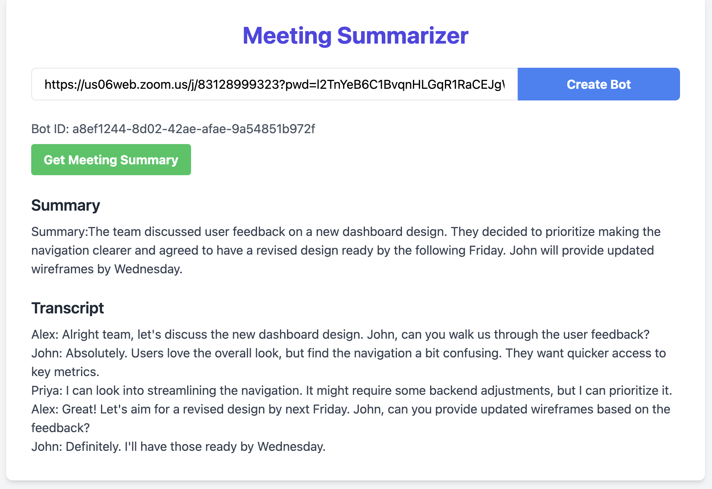

# Recall Demo Meeting Summarizer App

This demo application allows users to receive a summary of the meeting transcript by simply providing a meeting url.

## Description:

The purpose of this demo is to show how one can easily fetch live trancripts from any meeting, and make use of the transcripts to do more advanced things. In this case, we are simply providing a summary of the meeting.

This demo app does 3 things:
- Uses Recall.ai API to send a meeting bot instaneously to any live meeting.
- Use the Recall.ai API to fetch meeting transcript from any live meeting.
- Use an LLM (OpenAI in this case, but you can use anything really) to provide the summary, given the transcripts.

## Technologies Used

- Frontend (client-app): React, TypeScript, Tailwind CSS
- Backend (server-app): Express, TypeScript
- API: Axios for HTTP requests
- Recall.ai APIs for meeting bot and fetching transcripts
- OpenAI GPT 3.5 turbo for summarization 

## Project Structure

The project is divided into two main parts:

1. client-app: React application with TypeScript
2. server-app: Express server with TypeScript

## Setup and Running

### Pre-requisites

1. NodeJS >= v18
2. [Recall.ai API Key](https://docs.recall.ai/reference/authentication)
3. [OpenAI API Key](https://platform.openai.com/docs/quickstart)

### Frontend

1. Navigate to the `client-app` directory
2. Install dependencies: `npm install`
3. Run the build command: `npm run build`
4. Start the client server: `npm run start`

The frontend will be available at `http://localhost:3000` (i.e uses 3000 Port by default. However, if that Port is not available, it uses the next available Port.

### Backend

1. Navigate to the `server-app` directory
2. Install dependencies: `npm install`
3. Run the build command: `npm run build`
4. Start the backend server: `npm run start`

The backend will be available at `http://localhost:3002` . You can use another port by defining an environment variable named `PORT` in the `server-app/.env` file.

## How to Use

1. `cp .env.example .env`
2. Populate the values in your new .env file. `OPENAI_API_KEY`, and `RECALL_API_KEY` are mandatory.
3. Build and start your client-app as mentioned above.
4. Build and start your server-app as mentioned above.
5. Open `http://localhost:3000`
6. Paste your live meeting link in the input box, and click on `Create Bot`. This adds the bot to the meeting.
7. Now, you can go and participate in your meeting.
8. Once the Bot is added to the meeting, you will see a new button to `Get Meeting Summary`. Click on it. This will give you both the transcript and the meeting summary.
9. You can click on `Get Meeting Summary` any number of times, and it will fetch the new transcripts and summary every time.

PS: Please make sure you are aware of the charges from OpenAI and Recall when calling their APIs. Each click on `Get Meeting Summary` makes one call each to Recall.ai and OpenAI.
